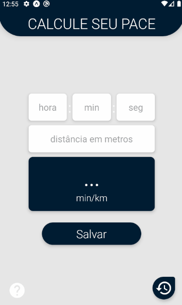

# Sobre o projeto:
Esse aplicativo é um projeto pessoal meu, que partiu da necessidade de medir o desempenho nos treinos de corrida de rua, através do cálculo do Pace(ritmo médio de corrida em min/km). 

Através desse app é possível calcular seu pace e salvá-lo no seu dispositivo.

Espera-se que esse projeto sirva como auxílio para outros corredores.

# Tecnologias usadas no projeto:

- React Native
- Expo
- Redux
- Redux Persist
- React Navigation

# Demo:

